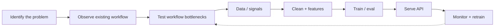

  
  <table>
    <tr>
      <td valign="middle" align="center">
        
      </td>
      <td valign="middle" align="center">
        
      </td>
    </tr>
  </table>

  <h1>HEY, I'm T</h1>
  
<strong>I build ML models, automate things, and craft sound.</strong> If the code breaks, I probably wrote it.

  

    <a href="https://cv.omnites.dev/">cv.omnites.dev</a>
    ·
    <a href="https://www.linkedin.com/in/tehilla-obanor/">LinkedIn</a>
  

### Current focus
ML systems that ship · cheap scalable automation · SaaS security hardening  
*Open to ML / automation collaborations*

### How I ship ML

### Featured projects

| Project | What it is |
| --- | --- |
| [LIP-READ](https://github.com/TEHILLA-O/LIP-READ) | Lip-reading from video/webcam — no audio in the pipeline |
| [staylab](https://github.com/TEHILLA-O/staylab) | Experiment analytics on real Airbnb London data + simulated A/B layer |
| [RAG-AUTOMATION](https://github.com/TEHILLA-O/RAG-AUTOMATION) | KnowledgeOps — incremental RAG, hybrid retrieval, knowledge gaps |
| [N8N-local-Automate](https://github.com/TEHILLA-O/N8N-local-Automate) | LocalFlow — n8n + Postgres, lead intake → review |
| [opportunity-intelligence-engine](https://github.com/TEHILLA-O/opportunity-intelligence-engine) | Collect, clean, score commercial opportunities — no LLM |
| [org-chart](https://github.com/TEHILLA-O/org-chart) | OrgPulse — people vs positions, interactive reporting graph |

Full list → [cv.omnites.dev](https://cv.omnites.dev/)

### Live demos

| Project | Demo |
| --- | --- |
| OrgPulse | [org-chart-ruby.vercel.app](https://org-chart-ruby.vercel.app) |
| Opportunity Intelligence | [opportunity-intelligence-engine-iota.vercel.app](https://opportunity-intelligence-engine-iota.vercel.app) |
| HaloCV | [for-the-students.vercel.app](https://for-the-students.vercel.app) |
| PMO dashboard | [pmo-dashbard.vercel.app](https://pmo-dashbard.vercel.app) |
| 3D CV | [3d-cv-blond.vercel.app](https://3d-cv-blond.vercel.app) |
| Omnific Hand | [omnifichand.vercel.app](https://omnifichand.vercel.app) |

### Stack
`Python` · `TypeScript` · `React` · `Node.js` · `PyTorch` · `Docker` · `PostgreSQL` · `Tailwind`

### Activity

  
  

