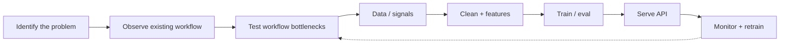

  
  <table>
    <tr>
      <td valign="middle" align="center">
        
      </td>
      <td valign="middle" align="center">
        
      </td>
    </tr>
  </table>

  <h1>HEY, I'm T</h1>
  
<strong>I build ML models, automate things, and craft sound.</strong> If the code breaks, I probably wrote it.

  

    
    ·
    <a href="https://cv.omnites.dev/">Projects · cv.omnites.dev</a>
    ·
    <a href="https://www.linkedin.com/in/tehilla-obanor/">LinkedIn</a>
  

  

### Current Focus
ML systems that ship · cheap scalable automation · SaaS security hardening  
*Open to ML / automation collaborations*

### How I ship ML

### Featured projects

  
  
  
  

<a href="https://cv.omnites.dev/"><strong>Full project list → cv.omnites.dev</strong></a>

### Stack

  
  
  
  
  
  
  
  

### This week

  

  
  

  

