

  
  
Contribution heatmap · refreshed from GitHub activity

  <table>
    <tr>
      <td valign="middle" align="center">
        
      </td>
      <td valign="middle" align="center">
        
      </td>
    </tr>
  </table>

  <h1>HEY, I'm T</h1>
  
<strong>I build ML systems and automation that ship.</strong> 
  Product tooling on the side. If the code breaks, I probably wrote it.

  

    <a href="https://cv.omnites.dev/">cv.omnites.dev</a>
    ·
    <a href="https://www.linkedin.com/in/tehilla-obanor/">LinkedIn</a>
  

### Selected work
I help UK teams cut repetitive ops work: data pipelines, RAG, experiment readouts, and internal tools through Omnific Hand and open case studies on GitHub.

### Current focus
ML systems that ship · cheap scalable automation · SaaS security hardening  
*Open to ML / automation collaborations · [LinkedIn](https://www.linkedin.com/in/tehilla-obanor/)*

### How I ship ML
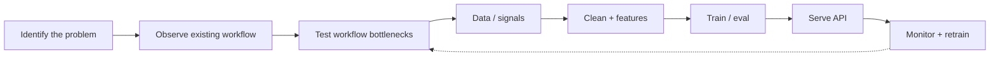

### Featured projects

| Project | What it is | Proof |
| --- | --- | --- |
| [LIP-READ](https://github.com/TEHILLA-O/LIP-READ) | Visual speech from video/webcam (no audio) | Full-pipeline WER **25.7%** · model path **5.7%** |
| [staylab](https://github.com/TEHILLA-O/staylab) | Experiment analytics on real Airbnb London data + simulated A/B | SQL metrics · z-test readout · FastAPI + Next.js |
| [RAG-AUTOMATION](https://github.com/TEHILLA-O/RAG-AUTOMATION) | KnowledgeOps: RAG, citations, knowledge gaps | **49** tests · **72%** coverage · MRR **0.625** |
| [N8N-local-Automate](https://github.com/TEHILLA-O/N8N-local-Automate) | LocalFlow: n8n and Postgres, lead to review | **10** workflows · Docker Compose case study |
| [opportunity-intelligence-engine](https://github.com/TEHILLA-O/opportunity-intelligence-engine) | Score commercial opportunities (no LLM) | pytest + Ruff · FastAPI · [Live demo](https://opportunity-intelligence-engine-iota.vercel.app) |
| [org-chart](https://github.com/TEHILLA-O/org-chart) | OrgPulse: people vs positions org graph | Vitest + Playwright · [Live demo](https://org-chart-ruby.vercel.app) |

Full list → [cv.omnites.dev](https://cv.omnites.dev/)

### Live demos

#### OrgPulse: org intelligence
Hierarchy · Faces · Reports

  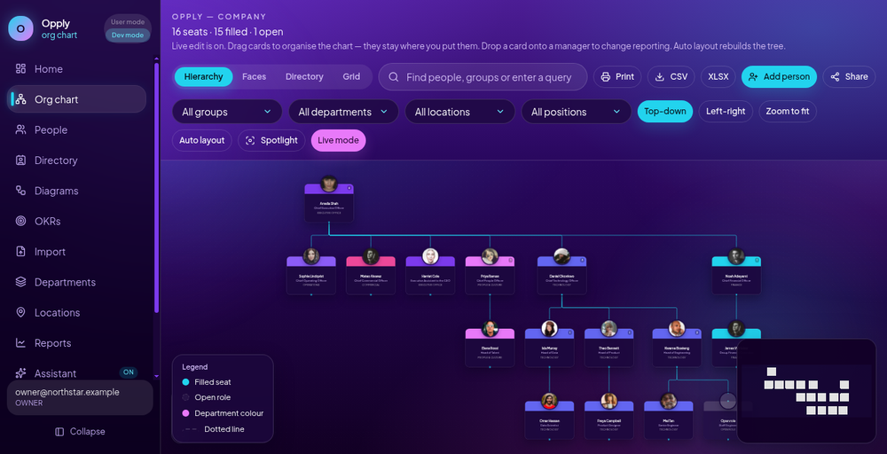
  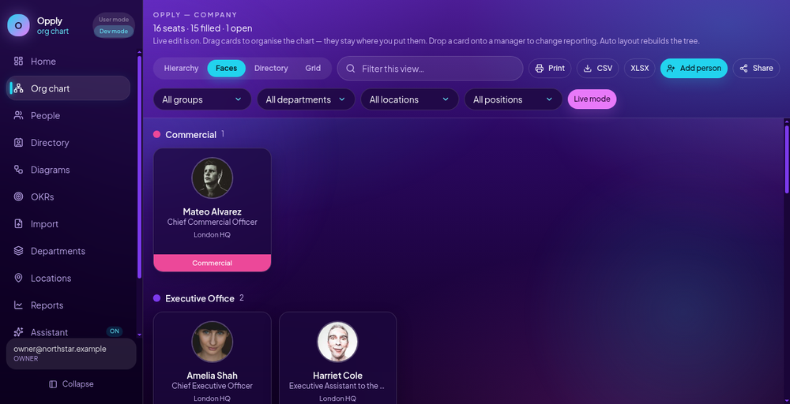
  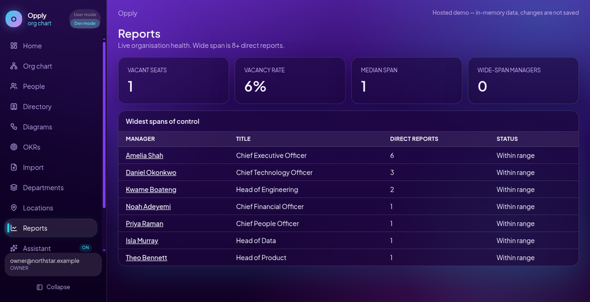

<a href="https://org-chart-ruby.vercel.app"><strong>Live demo →</strong></a>

#### HaloCV: ATS toolkit for students
Scan · Compare · CV builder

  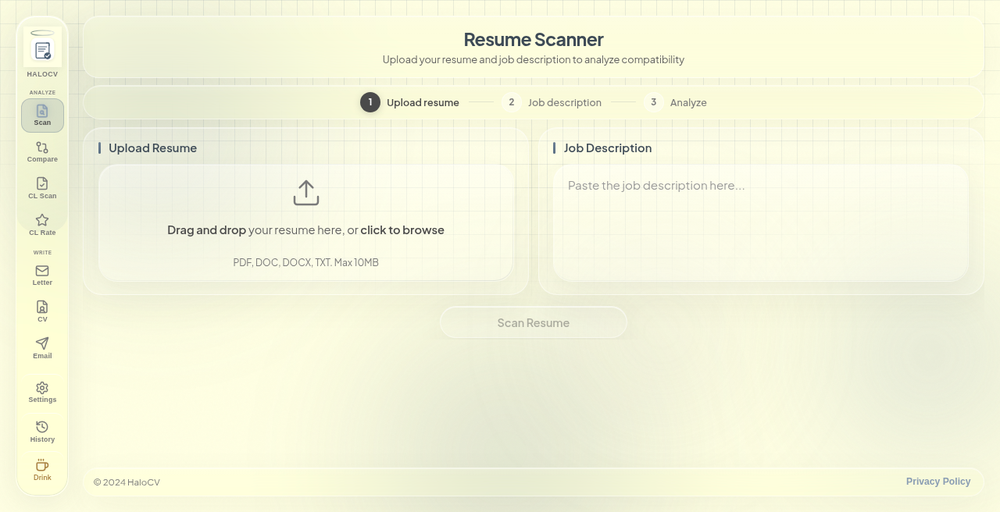
  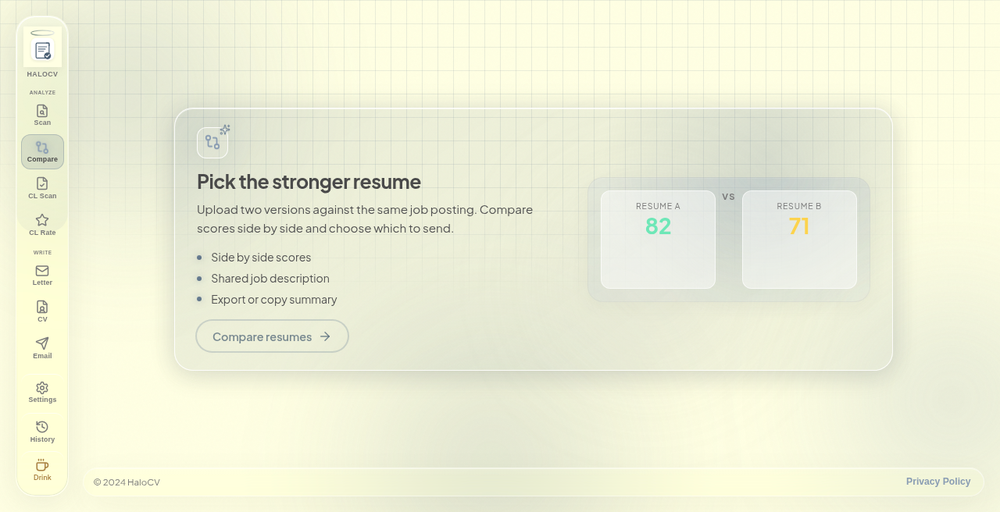
  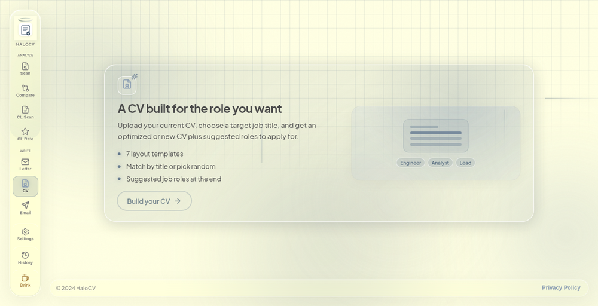

<a href="https://for-the-students.vercel.app"><strong>Live demo →</strong></a>

#### Opportunity Intelligence: scored deal flow
Dashboard · Pipeline runs

  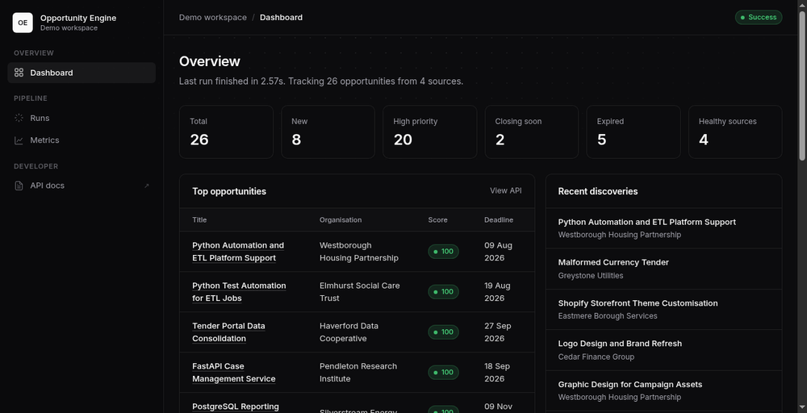
  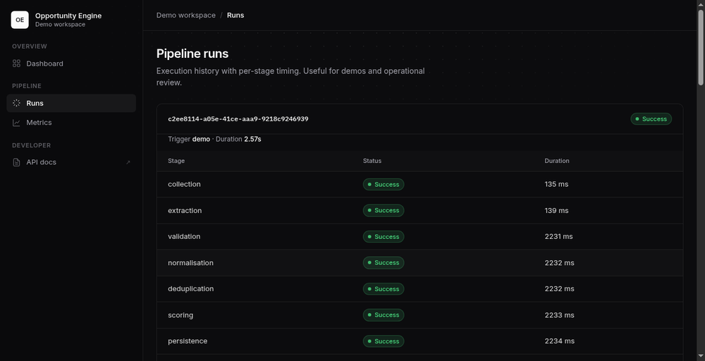

<a href="https://opportunity-intelligence-engine-iota.vercel.app"><strong>Live demo →</strong></a>

#### PMO dashboard: portfolio intelligence
Overview · Executive charts

  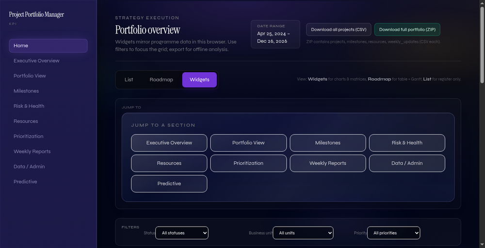
  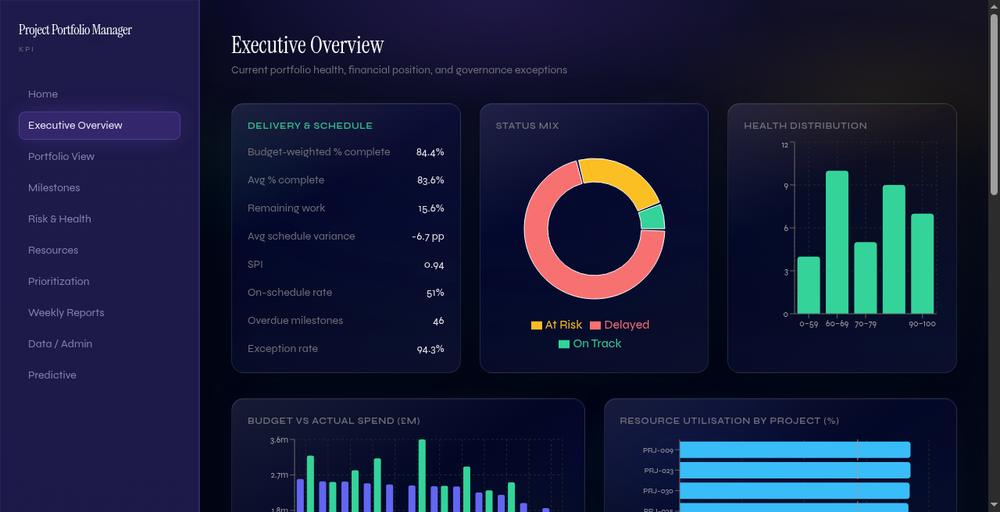

<a href="https://pmo-dashbard.vercel.app"><strong>Live demo →</strong></a>

| Also live |  |
| --- | --- |
| 3D CV | [Live demo](https://3d-cv-blond.vercel.app) |

### Stack
`Python` · `TypeScript` · `React` · `Node.js` · `PyTorch` · `Docker` · `PostgreSQL` · `Tailwind` · `n8n` · `FastAPI`
